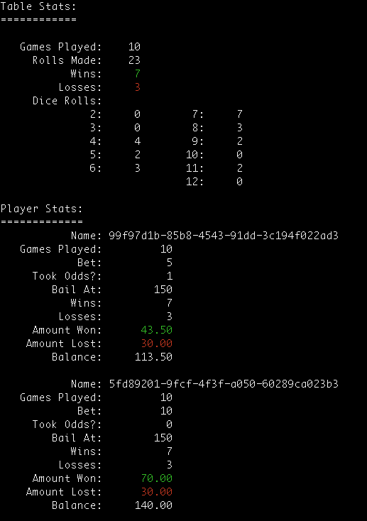

I'm traveling to Vegas for a conference, and since I'm not much of a gambler,  I decided to write a craps simulator so that I could test betting strategies in the game.

I also wrote this to gain a little experience in creating a software architecture which is event-driven from the ground up.

# Requirements
- PHP 5.5
- Composer.

# Installion

- Clone this repo
- Run `composer install`

# Syntax

`./main.php --players [balance,bet_amount[,take_odds[,bail_out_at]][:player2[:...]]] [--num-games num] [-v] [-vv] [--debug-roll [roll[,roll[,...]]]]`

- `--num-games` How many games to play?  10 is the default.
- `--players` Used to specify one or more players.  The syntax is: balance,bet_amonut,take_odds,bail_out_at
    - balance - Starting balance
    - bet_amount - How much to bet per bet.  The only bet supported at this time is Pass.
    - take_odds - Take odds if a point has been established?  Valid values are 0 and 1.
    - bail_out_at - Leave the game when we reach this number.
- `-v` Verbose mode.  Logging will be done at the INFO level.
- `-vv` Really verbose mode. Logging will be done at the DEBUG level.
- `--debug-roll` Used to force the first dice rolls to be pre-detrmined.  This is useful for whitebox testing.

A successful will produce results similar this:

# FAQ

## Why aren't other bets supported?

There are [plenty of other bets](http://www.nextshooter.com/bets) one can make in craps, but the Pass bet is one of the safest bets in craps, wiht a house edge of 1.41%.  If the shooter establishes a point, taking odds is even safer as it pays even money, with no house edge.

## Don't Pass has an even lower house edge? Why didn't you put that bet in your code?

Because betting against the shooter is considered a dick move at the craps table.  I don't want to be That Guy.

## If I run a simulation long enough, I eventually lose all of my money.  Why?

> *Because the house always wins. Play long enough, you never change the stakes. The house takes you. Unless, when that perfect hand comes along, you bet and you bet big, then you take the house.*  -- Daniel Ocean

Craps is no different from any other game in a casino--the house has an edge. If you gamble long enough you *will* lose all of your money.  You may want to consider this before setting foot in a casino.

# Contact

I'm @dmuth on [Facebook](http://facebook.com/dmuth) and [Twitter](http://twitter.com/dmuth).  Feel free to hit me up there, or via email: dmuth@dmuth.org.

